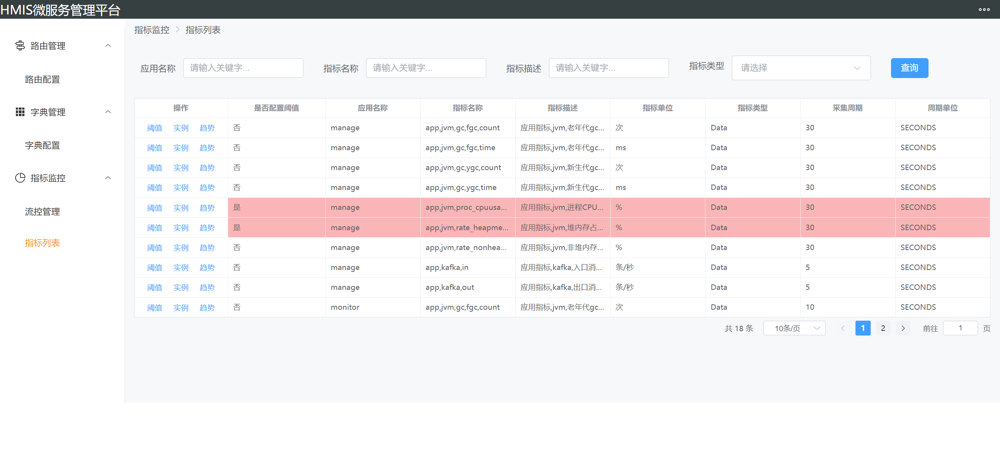

## 说明

是一个微服务的基础代码库，可用于日常快速开发，主要包含以下内容：

- 基础依赖包 `common`
  - `RESTful`接口版本控制（基于注解）、返回包装器
  - `RESTful`接口加解密支持（基于注解）
  - 分布式锁（基于`redis`+`lua`）
  - 任务调度辅助代码（基于注解）
  - 通用字典管理
  - 规则引擎（一套自定义的强大规则表达式解析、匹配）
  - 常用增强工具类
  - 接口缓存（基于`spring-cache`扩展，支持`expire`）（基于注解）
  - 自定义增强应用端点（线程`CPU`负荷分析、网络连接分析）
  - 分布式ID（基于`Twitter`的雪花算法`SnowFlake`实现）
  - 数据库连接池动态切换支持（基于注解）
- 应用指标采集 `agent`
  - 默认内置`jvm`、`kafka`出入口消息指标采集
  - 支持自定义指标扩展采集（实现对应接口）
  - 默认指标采集后发送给`kafka`集群
  - 中间件、数据库、主机等其他资源均可通过此套接口封装采集逻辑
- 指标阈值管理`monitor`
  - 指标数据收集存储（默认保存`24`小时的数据，可配置）
  - 指标趋势数据查看（可根据应用纬度、单实例纬度）
  - 指标阈值配置（`manage`中包含管理页面）
  - 指标数据匹配阈值引擎核心逻辑
  - 警告通知适配（默认支持`UNISMS`第三方短信平台，可自行扩展其他）
- 配置管理扩展包 `config`
  - 适配`zk`配置中心，支持配置加密存储读取
  - 扩展`ZKUI`开源组件作为默认配置中心（扩展实现了配置数据的可用性处理、查询、批量批量等功能）
- `kafka`事件管理扩展包 `event`
  - 适配`kafka`消息，对字符串消息做`javabean`映射处理，增强`kafka`消息的可读性处理
  - 可根据业务自行扩展消息
  - 客户端只需依赖此组件，实现指定接口即可
- 门户网关 `gateway`
  - 扩展`SpringCloud Gateway`实现动态路由功能，将路由保存入数据库
  - 管理模块已实现对应路由管理配置页面
- 维护管理包 `manage`
  - 字典管理页面
  - 路由管理页面
  - 指标阈值配置页面
  - `kafka`入口消息流控速率配置管理页面

## 技术栈

- 微服务相关 `k8s`、`docker`、`SpringCloud Gateway`(网关)、`Zookeeper/ZKUI`(配置中心)

- 开发框架 `SpringBoot`、`Vue3`、`Element-UI`、`webpack`、`typescript`
- 中间件 `Kafka`、`Mysql`、`Oracle`、`redis`、`zk`

## 各组件

- [common](common/README.md)
- [agent](agent/README.md)
- [config](config/README.md)
- [event](event/README.md)
- [gateway](gateway/README.md)
- [manage](manage/README.md)
- [monitor](monitor/README.md)

## 计划

+ [ ] 配置管理集成ZKUI的管理页面
+ [ ] 常用中间件、数据库、主机等指标采集实现
+ [ ] 网关实现灰度发布功能
+ [ ] 统一认证服务，网关统一鉴权
+ [ ] 权限管理（菜单、api等纬度）、防垂直越权
+ [ ] 可配置化页面快速开发功能（类似低代码，纯配置）
+ [ ] ......

