## 配置中心

### 微服务适配


- 配置文件

参考：[monitor/src/main/resources/bootstrap.properties](../monitor/src/main/resources/bootstrap.properties)

```properties
spring.application.name=monitor
spring.cloud.zookeeper.enabled=${spring_cloud_zookeeper_enabled}
spring.cloud.zookeeper.connect-string=${spring_cloud_zookeeper_connectString}
spring.cloud.zookeeper.config.root=/com/github/hbq
spring.cloud.zookeeper.config.watcher.enabled=false
spring.cloud.zookeeper.config.defaultContext=common
spring.cloud.zookeeper.config.profileSeparator=,
spring.cloud.zookeeper.auth.schema=digest
spring.cloud.zookeeper.auth.info=${spring_cloud_zookeeper_auth_info}
```


| 属性名                                         | 属性值            | 说明                     |
| :--------------------------------------------- | :---------------- | :----------------------- |
| spring.application.name                        | monitor           | 服务名                   |
| spring.cloud.zookeeper.enabled                 | true              | 配置是否从配置中心读取   |
| spring.cloud.zookeeper.connect-string          | 192.168.56.2:2181 | 配置中心地址             |
| spring.cloud.zookeeper.config.root             | /com/github/hbq   | 配置目录                 |
| spring.cloud.zookeeper.config.watcher.enabled  | false             | 是否启用动态监听配置变化 |
| spring.cloud.zookeeper.config.defaultContext   | common            | 默认配置读取目录         |
| spring.cloud.zookeeper.config.profileSeparator | ,                 | profiles分隔符           |
| spring.cloud.zookeeper.auth.schema             | digest            | zk加密算法               |
| spring.cloud.zookeeper.auth.info               | ****              | zk认证密码               |


- maven依赖

```xml
<dependency>
    <groupId>org.springframework.cloud</groupId>
    <artifactId>spring-cloud-starter-zookeeper-config</artifactId>
</dependency>
```


### 管理界面

#### 配置显示

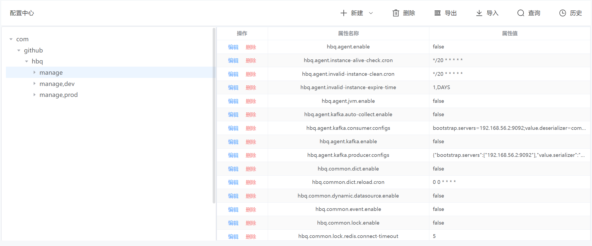


#### 创建目录

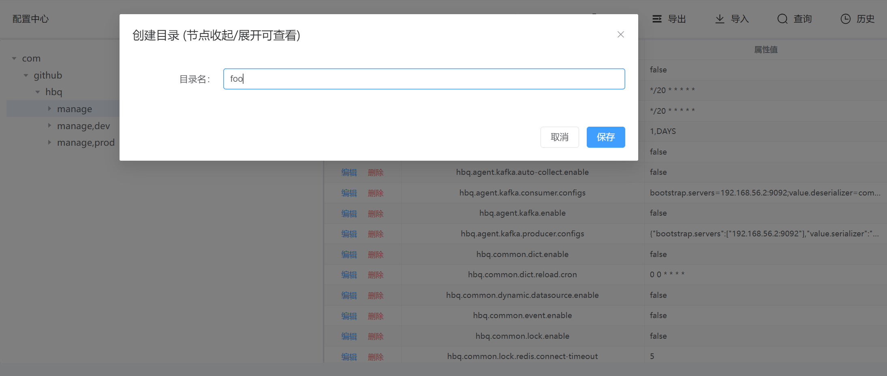


#### 新增配置

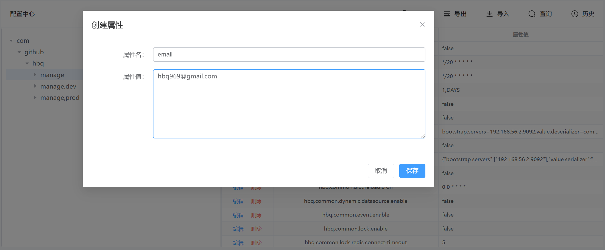


#### 批量删除配置

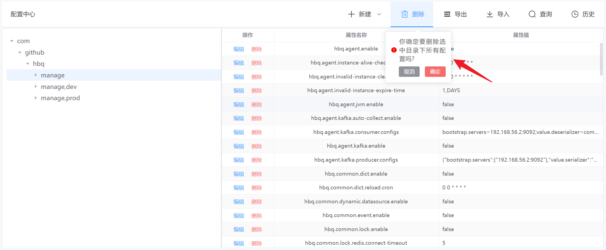


#### 删除单条配置

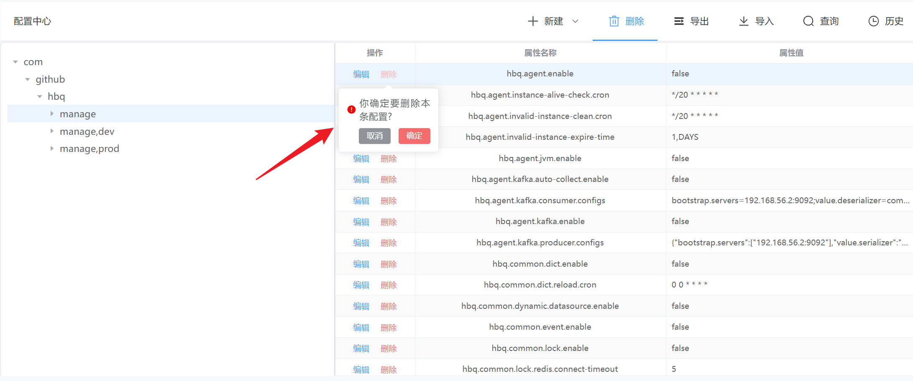


#### 导出配置

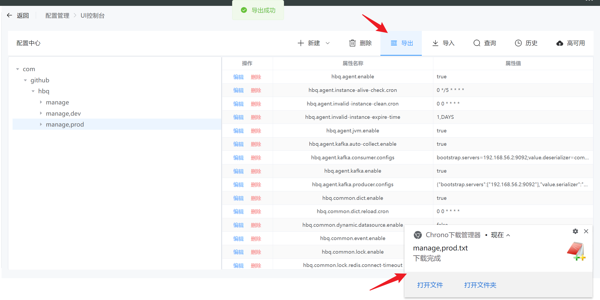

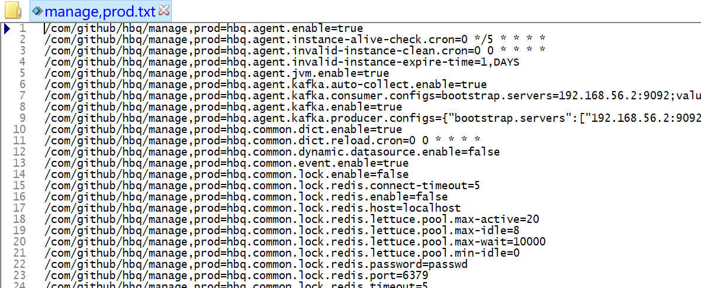


#### 导入配置

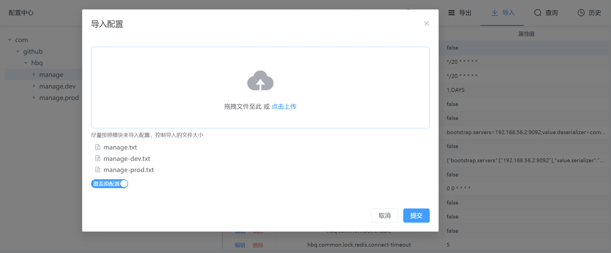

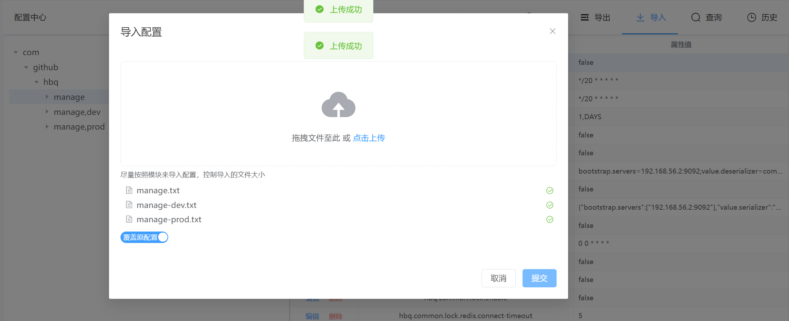

导入文件可通过工具类创建生成 `com.github.hbq.common.utils.ConfigUtils`

```java
// 单module工程下
ConfigUtils.of().build();

// 多module工程下，需要传入module名称
ConfigUtils.of("manage").build("dev");
ConfigUtils.of("manage").build("prod");
```


#### 配置查询

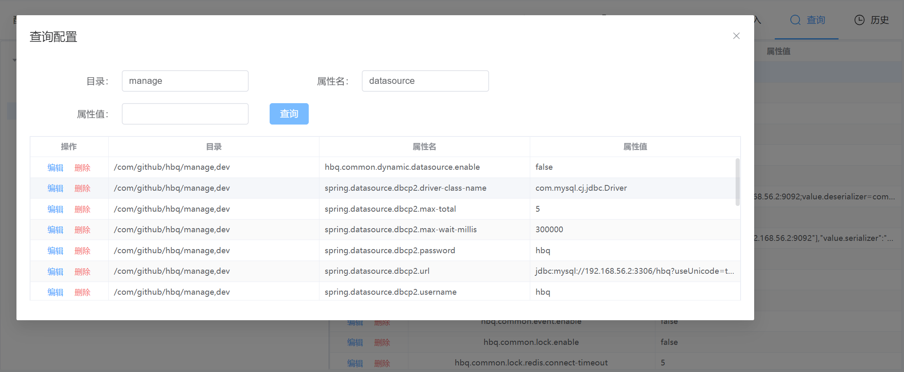


#### 操作日志查询

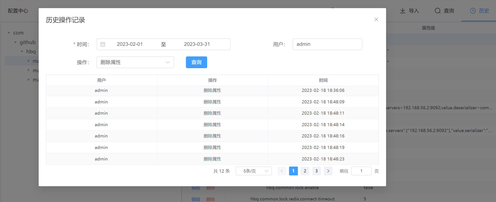


#### 备份恢复

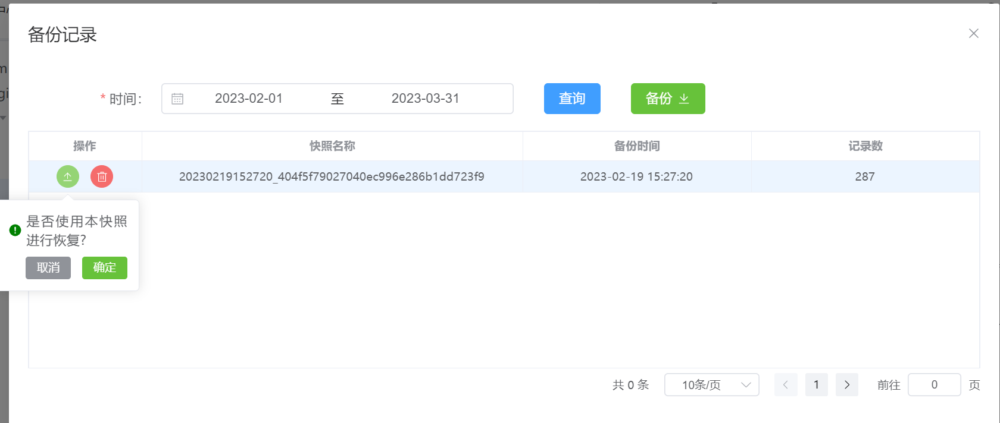


## 后续计划

+ [x] ~~增加配置数据高可用保存功能，快照数据保存~~
+ [x] ~~根据快照数据进行恢复~~
+ [ ] 配置数据批量替换
+ [ ] 角色权限控制
+ [ ] 配置刷新（全量、针对服务、针对实例各种纬度）
+ [ ] 敏感数据脱敏处理