## 配置中心


### 背景场景

​	目前主流的开源配置中心有：`SpringCloud Config`、`Nacos`、`Apollo`、`Disconf`，都是比较优秀的开源方案，为啥还要搞一个出来，主要原因为2个方面吧：首先`zk`本身的机制就支持集群部署保证了配置服务的可用性和安全性，可以将`zk`作为数据存储介质，另外也方便日后有特殊的需求能自行进行扩展实现。


### 部署架构

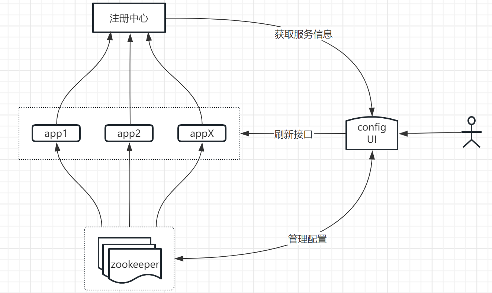


### 安装部署

#### 安装`Zookeeper`集群

参考 [Apache Zookeeper](https://zookeeper.apache.org/doc/r3.5.10/zookeeperStarted.html)


#### 单机部署(standalone)

1. 获取源码

```bash
git clone https://github.com/hbq969/hmis.git
```


2. 调整环境参数

- hmis-master/config/src/main/resources/static/.env

```properties
# ------------------------------------------------------------------------------
# This is an example .env file.
#
# All of these environment vars must be defined either in your environment or in
# a local .env file in order to run the demo for this project.
# ------------------------------------------------------------------------------

# gateway
# VUE_APP_DEV_BASE_URL=http://192.168.56.2:20000/hmis/config/ui
# VUE_APP_PROD_BASE_URL=http://192.168.56.2:20000/hmis/config/ui

# development
# VUE_APP_DEV_BASE_URL=http://localhost:21000/ui
# VUE_APP_PROD_BASE_URL=http://localhost:21000/ui

# standalone
VUE_APP_DEV_BASE_URL=.
VUE_APP_PROD_BASE_URL=.

```


- hmis-master/config/src/main/resources/application.propeties

```bash
# 数据库
spring.datasource.dbcp2.driver-class-name=com.mysql.cj.jdbc.Driver
spring.datasource.dbcp2.url=jdbc:mysql://192.168.56.2:3306/hbq?useUnicode=true&serverTimezone=GMT%2B8&characterEncoding=utf8
spring.datasource.dbcp2.username=hbq
spring.datasource.dbcp2.password=hbq
spring.datasource.dbcp2.max-total=5
spring.datasource.dbcp2.max-wait-millis=300000
spring.datasource.dbcp2.validation-query=select 1

# mybatis
mybatis.config-location=classpath:jpaConfig.xml
mybatis.mapper-locations=classpath*:com/**/common/*Mapper.xml,classpath*:com/**/mysql/*Mapper.xml

# Consul
spring.cloud.consul.enabled=true
spring.cloud.consul.discovery.enabled=true
spring.cloud.consul.host=192.168.56.2
spring.cloud.consul.port=8500

# ZK集群地址(配置中心数据存储)
zkUrl=192.168.56.2:12181
zkSessionTimeoutMills=5000
```


- hmis-master/config/src/main/deploy/setenv.sh

```properties
export spring_cloud_zookeeper_enabled="false"
```


3. 构建打包

```bash
cd hmis-master/config/src/main/resources/static
npm install
npm run build
cd hmis-master/config
mvn -skipTests=true clean package
```

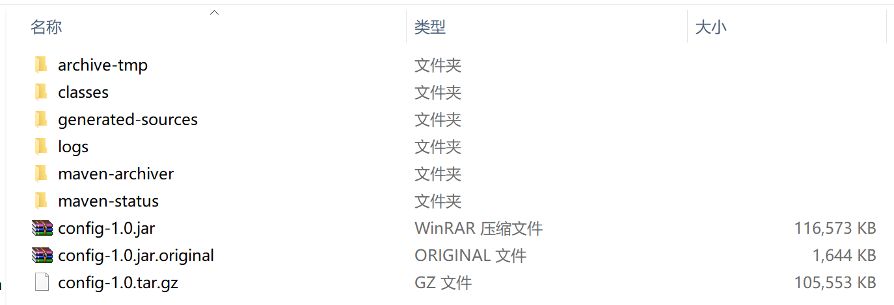


4. 安装部署

- 本地

```bash
cd config-1.0/target
java -jar -Dspring_cloud_zookeeper_enabled=false config-1.0.jar
```

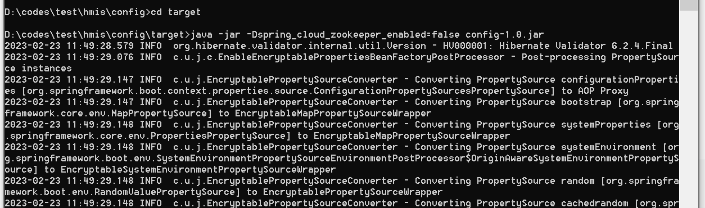


- vm

```bash
tar -xvf config-1.0.tar.gz
cd config-1.0/deploy/bootstrap
sh start.sh
```


- docker

```
cd config-1.0/deploy/docker
sh start.sh
```


- k8s

```
cd config-1.0/deploy/kubernetes
sh create.sh
```

注意：

需要暴露监听端口，要么使用`NodePort`方式，要么使用网关或其他代理组件进行暴露，否则没法访问`UI`控制台。


#### 配合gateway部署

调整环境参数

- hmis-master/config/src/main/resources/static/.env

```properties
# ------------------------------------------------------------------------------
# This is an example .env file.
#
# All of these environment vars must be defined either in your environment or in
# a local .env file in order to run the demo for this project.
# ------------------------------------------------------------------------------

# gateway
VUE_APP_DEV_BASE_URL=http://192.168.56.2:20000/hmis/config/ui
VUE_APP_PROD_BASE_URL=http://192.168.56.2:20000/hmis/config/ui

# development
# VUE_APP_DEV_BASE_URL=http://localhost:21000/ui
# VUE_APP_PROD_BASE_URL=http://localhost:21000/ui

# standalone
# VUE_APP_DEV_BASE_URL=.
# VUE_APP_PROD_BASE_URL=.
```


再在路由界面配置路由转发规则

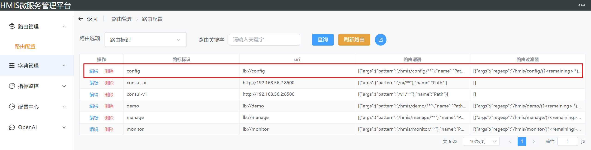


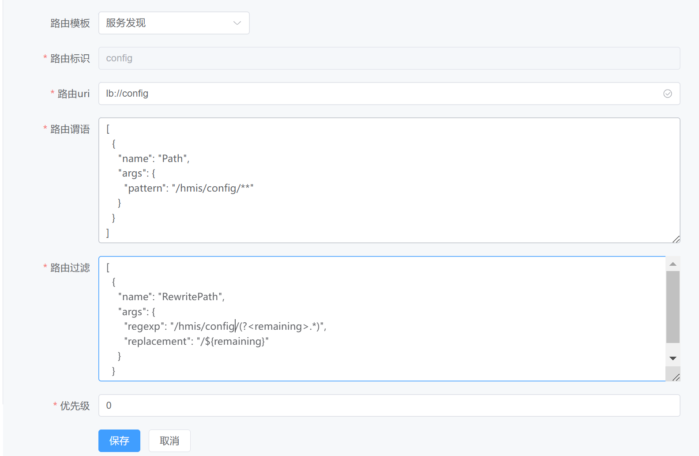


### UI控制台

#### 访问方式

- 单机模式(standalone)

http://192.168.56.2:21000/ui/index.html

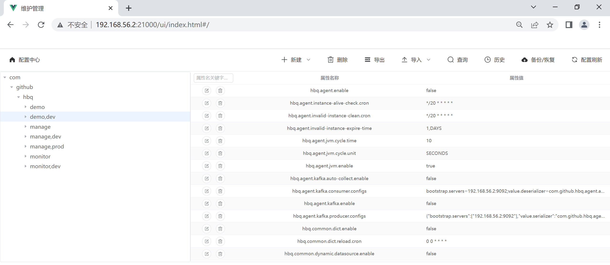


- gateway模式

http://192.168.56.2:20000/hmis/config/ui/index.html

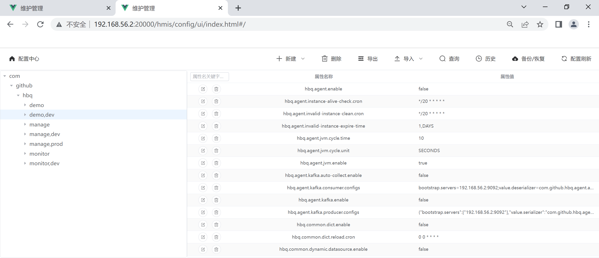


#### 配置显示


#### 创建目录


#### 新增配置


#### 批量删除配置


#### 删除单条配置


#### 导出配置


#### 导入配置

##### txt文件

由`ConfigUtils`工具类根据`springboot`配置文件生成`txt`文件

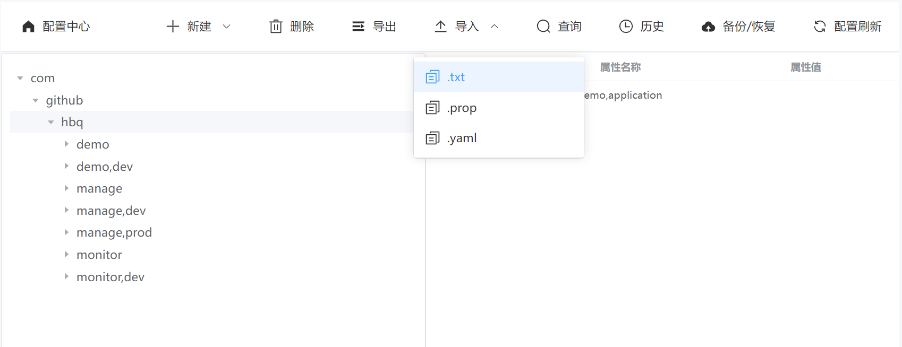


导入文件可通过工具类创建生成 `com.github.hbq.common.utils.ConfigUtils`

```java
// 单module工程下
ConfigUtils.of().build();

// 多module工程下，需要传入module名称
ConfigUtils.of("manage").buildDev();
ConfigUtils.of("manage").buildProd();
ConfigUtils.of("manage").build("xxx");
```


##### properties文件

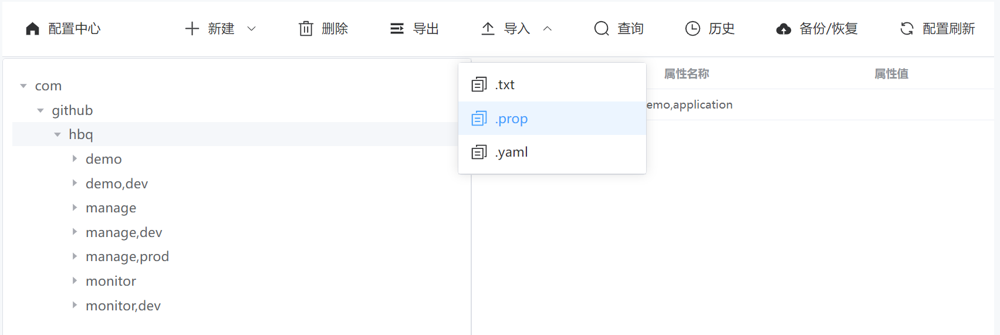


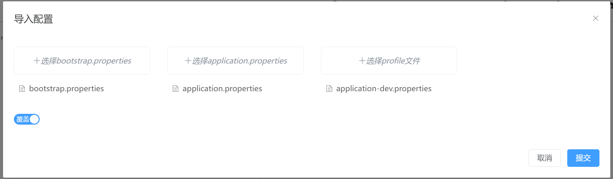


##### yml文件

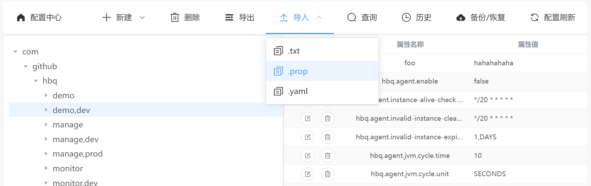


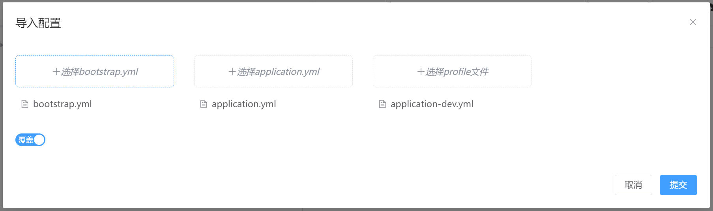


#### 配置查询


#### 操作日志查询


#### 备份恢复


#### 刷新应用配置

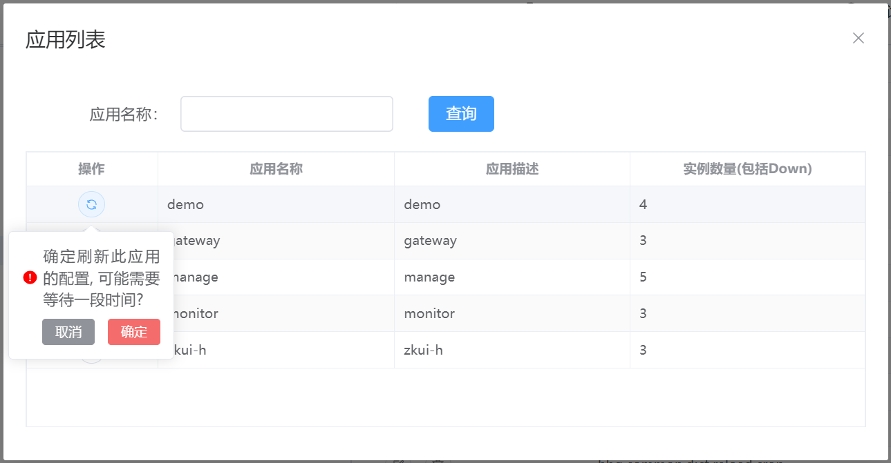


此功能需要config开启服务发现，应用开启服务注册：

- config端增加配置(Consul注册中心版本，其他适配后续版本支持)

```properties
# 如果向注册中心注册时不带上actuator-path这个标签，则使用默认值/hbq-actuator
spring.cloud.consul.discovery.tags=path=/${spring.application.name},port=${server.port},secure=false,actuator-path=${management.endpoints.web.base-path}
management.endpoints.jmx.exposure.exclude=*
management.endpoints.web.base-path=/hbq-actuator
management.endpoint.refresh.enabled=true
management.endpoints.web.exposure.include=refresh
```

- 应用端开启服务注册，并且需要动态加载配置的类上添加如下注解

```java
@RefreshScope
@Service
public class DemoService {

  @Value("${foo}")
  private String foo;
  
  public void greeting() {
    log.info("foo: {}", foo);
  }
  
}
```


### 应用如何接入zk配置中心


- 配置文件

`src/main/resources/bootstrap.properties`

```properties
spring.application.name=demo
spring.cloud.zookeeper.enabled=${spring_cloud_zookeeper_enabled}
spring.cloud.zookeeper.connect-string=${spring_cloud_zookeeper_connectString}
spring.cloud.zookeeper.config.root=/com/github/hbq
spring.cloud.zookeeper.config.watcher.enabled=false
spring.cloud.zookeeper.config.defaultContext=common
spring.cloud.zookeeper.config.profileSeparator=,
spring.cloud.zookeeper.auth.schema=digest
spring.cloud.zookeeper.auth.info=${spring_cloud_zookeeper_auth_info}
```


| 属性名                                         | 属性值             | 说明                                                         |
| :--------------------------------------------- | :----------------- | :----------------------------------------------------------- |
| spring.application.name                        | demo               | 服务名                                                       |
| spring.cloud.zookeeper.enabled                 | true               | 配置是否从配置中心读取<br/>可以通过deploy/setenv.sh传入环境变量 |
| spring.cloud.zookeeper.connect-string          | 192.168.56.2:12181 | 配置中心地址<br/>可以通过deploy/setenv.sh传入环境变量        |
| spring.cloud.zookeeper.config.root             | /com/github/hbq    | 配置目录                                                     |
| spring.cloud.zookeeper.config.watcher.enabled  | false              | 是否启用动态监听配置变化                                     |
| spring.cloud.zookeeper.config.defaultContext   | common             | 默认配置读取目录                                             |
| spring.cloud.zookeeper.config.profileSeparator | ,                  | profiles分隔符                                               |
| spring.cloud.zookeeper.auth.schema             | digest             | zk加密算法                                                   |
| spring.cloud.zookeeper.auth.info               | ****               | zk认证密码<br/>可以通过deploy/setenv.sh传入环境变量          |


- maven依赖

```xml
<dependency>
    <groupId>org.springframework.cloud</groupId>
    <artifactId>spring-cloud-starter-zookeeper-config</artifactId>
</dependency>
```


## 后续计划

+ [x] ~~增加配置数据高可用保存功能，快照数据保存~~
+ [x] ~~根据快照数据进行恢复~~
+ [ ] 配置数据批量替换
+ [ ] 角色权限控制
+ [x] ~~配置刷新（全量、针对服务、针对实例各种纬度）~~
+ [ ] 敏感数据脱敏处理
+ [x] ~~支持`properties`和`yaml`文件直接导入~~