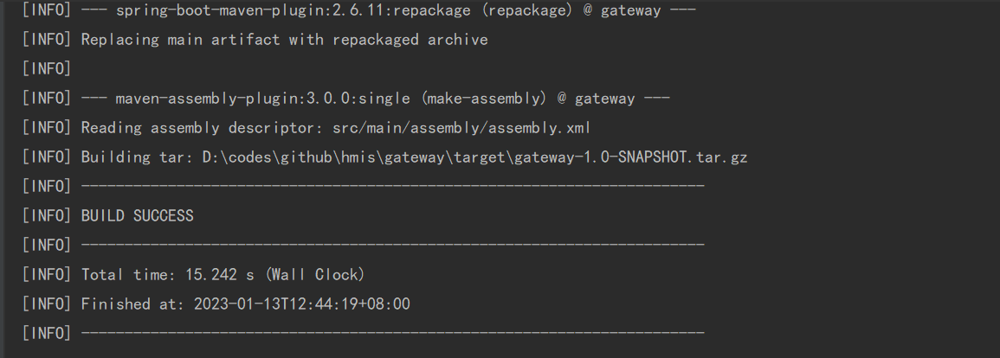
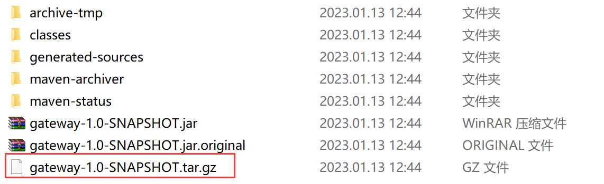
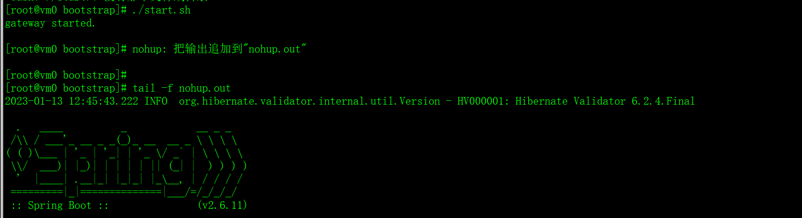

## 安装使用

### 打包

```shell
cd gateway
mvn -DskipTests=true clean package
```






### 部署

解压部署介质

```shell
tar -xvf gateway-1.0-SNAPSHOT.tar.gz
```


调整环境变量(系统级别的配置，如果需要调整应用级的配置可自行增加配置文件或指定环境变量进行覆盖)

```bash
cd gateway-1.0-SNAPSHOT/deploy
vi setenv.sh
```

```bash
#!/bin/sh
# docker配置
export docker_registry="localhost:9443"
export docker_ns=""
export docker_prefix="${docker_registry}${docker_ns}"
export docker_registry_user=""
export docker_registry_pwd=""
# k8s配置
export k8s_ns="default"
export k8s_api_version="apps/v1"
# 配置中心
export spring_cloud_zookeeper_enabled="false"
export spring_cloud_zookeeper_connectString="localhost:2181"
export spring_cloud_zookeeper_auth_info="huangbq:123456"
export spring_cloud_zookeeper_auth_secky=""
export spring_profiles_active="dev"
```


启动应用(支持vm、docker、k8s三种部署方式)

以vm启动为例

```bash
cd gateway-1.0-SNAPSHOT/bootstrap
./start.sh
```



