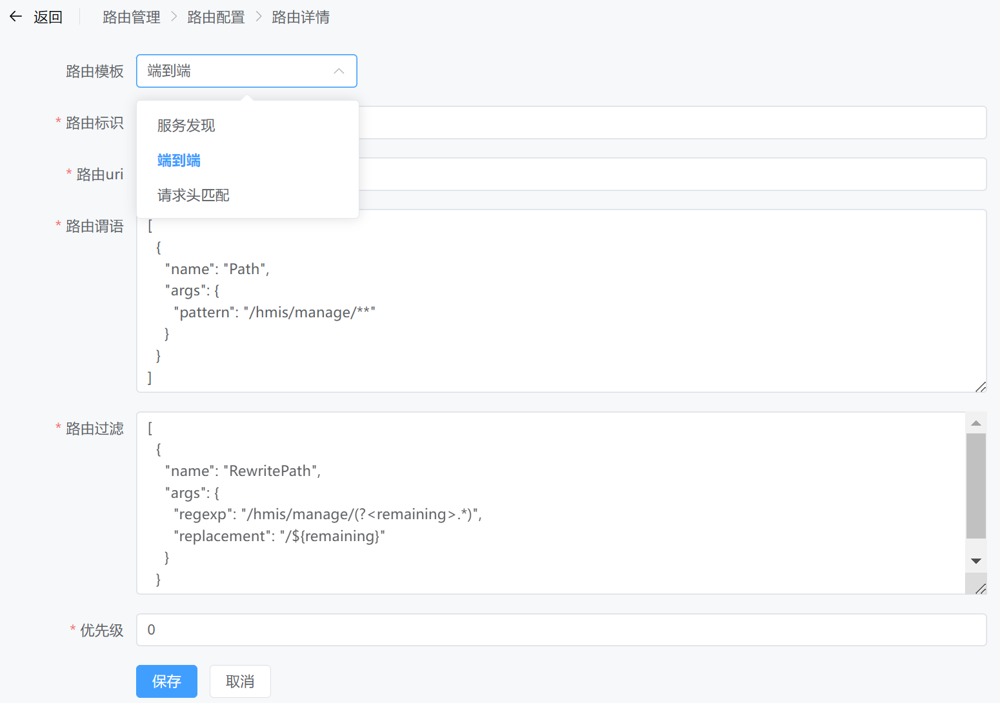
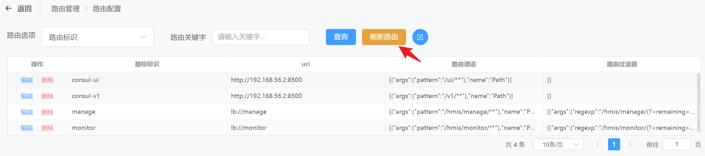

## 安装使用

### 打包

```shell
cd gateway
mvn -DskipTests=true clean package
```


### 部署

解压部署介质

```shell
tar -xvf gateway-1.0-SNAPSHOT.tar.gz
```


调整环境变量(系统级别的配置，如果需要调整应用级的配置可自行增加配置文件或指定环境变量进行覆盖)

```bash
cd gateway-1.0-SNAPSHOT/deploy
vi setenv.sh
```

```bash
#!/bin/sh
# docker配置
export docker_registry="localhost:9443"
export docker_ns=""
export docker_prefix="${docker_registry}${docker_ns}"
export docker_registry_user=""
export docker_registry_pwd=""
# k8s配置
export k8s_ns="default"
export k8s_api_version="apps/v1"
# 配置中心
export spring_cloud_zookeeper_enabled="false"
export spring_cloud_zookeeper_connectString="localhost:2181"
export spring_cloud_zookeeper_auth_info="huangbq:123456"
export spring_cloud_zookeeper_auth_secky=""
export spring_profiles_active="dev"
```


启动应用(支持vm、docker、k8s三种部署方式)

以vm启动为例

```bash
cd gateway-1.0-SNAPSHOT/bootstrap
./start.sh
```


## 路由管理

- 路由查询


- 新增路由




|  路由模板  |             使用场景             |
| :--------: | :------------------------------: |
|   端到端   |  点对点场景，直接配置ip端口路由  |
|  服务发现  |   通过注册中心自动拉取服务列表   |
| 请求头匹配 | 通过匹配请求头的头属性来路由转发 |


- 手动刷新路由

当然默认就是自动刷新，任何修改路由的操作都会触发动态刷新




## 后续计划

+ [ ] IPHash路由转发支持
+ [ ] 统一鉴权、认证模块开发
+ [ ] 灰度发布功能支持
+ [ ] 更多谓语规则模板化