## 安装使用

### 打包

包含`ui`代码和`微服务`代码的打包

```shell
cd manage
mvn -DskipTests=true clean package
```


### 部署

同门户网关。


## 维护页面

### 路由管理

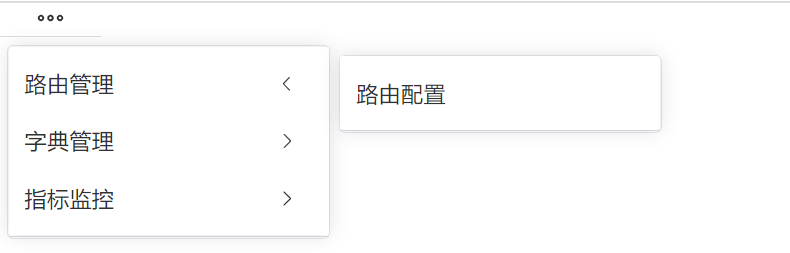

- 路由查询

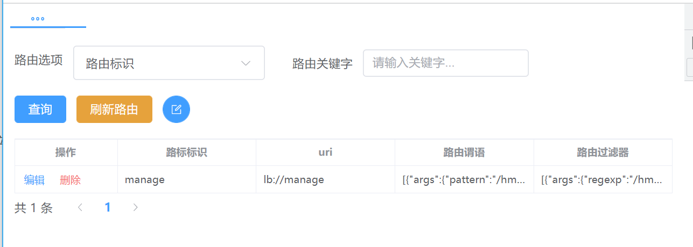


- 路由新增、编辑

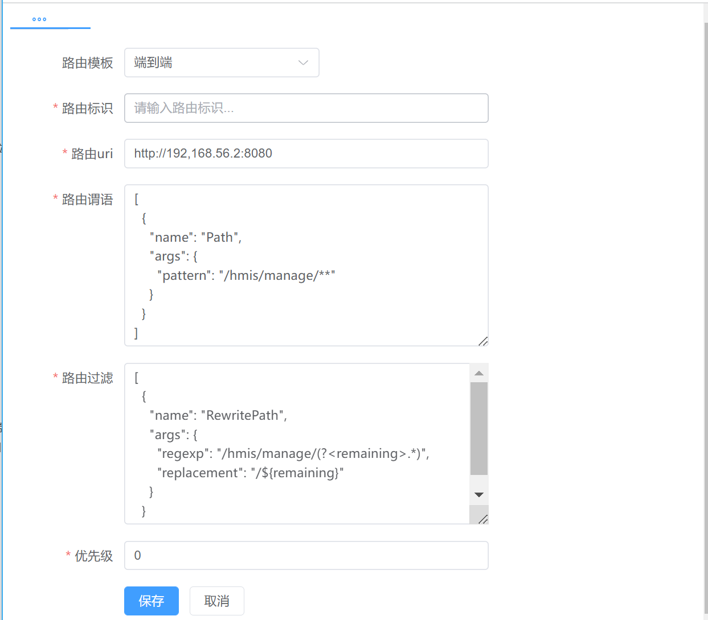


### 字典管理

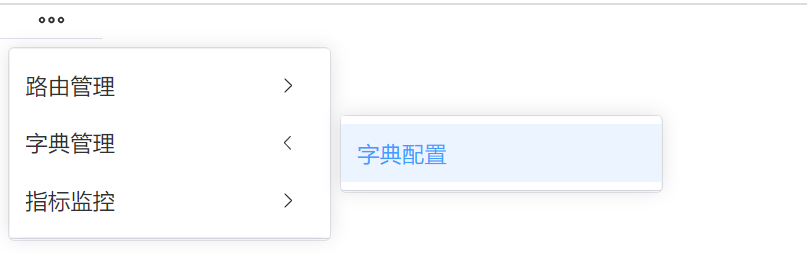

- 字典查询

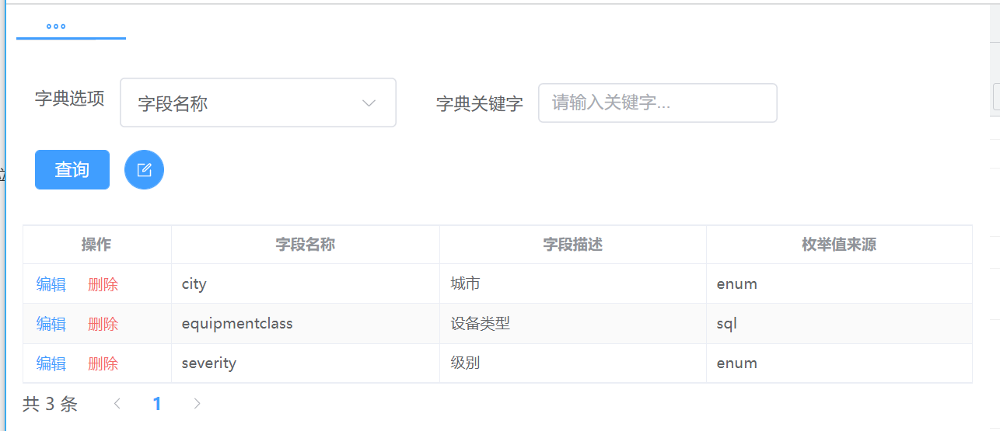


- 字典新增、编辑

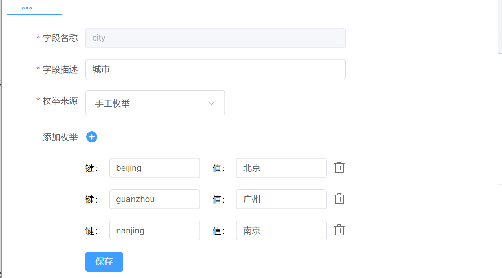


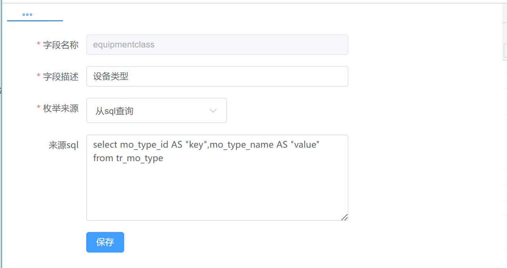


### 应用kafka入口消息速率管理

可针对应用或实例两个纬度进行限速配置。


- 应用限速管理


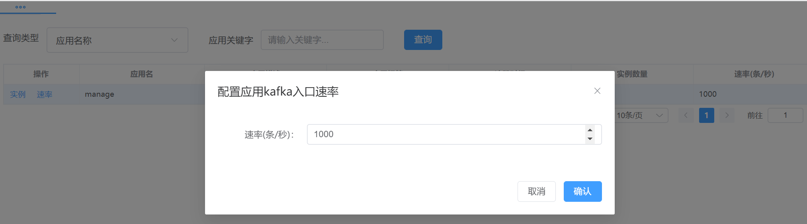


- 实例限速管理


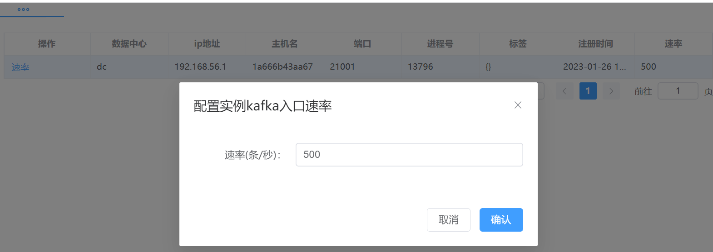


### 指标管理

#### 指标列表

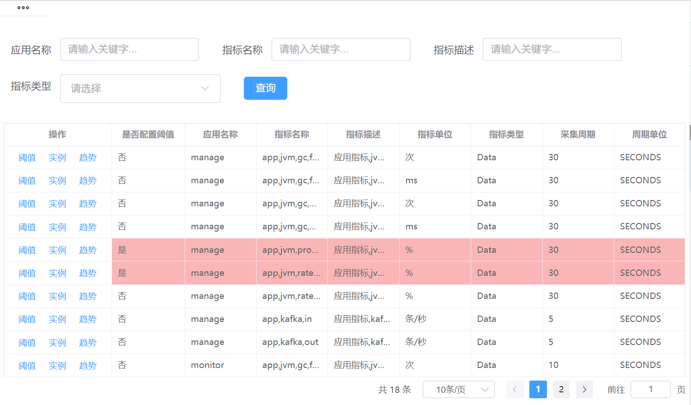

#### 指标阈值配置

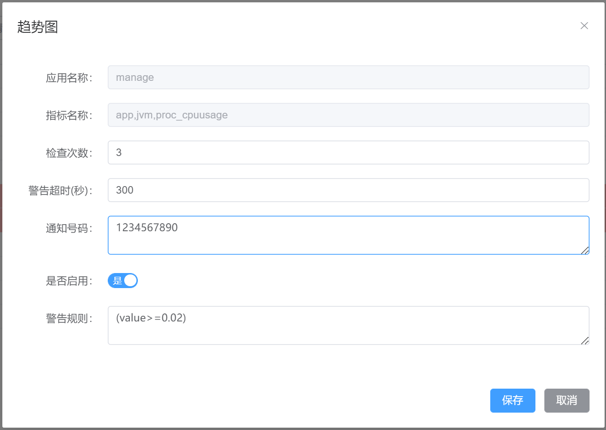

#### 应用指标趋势

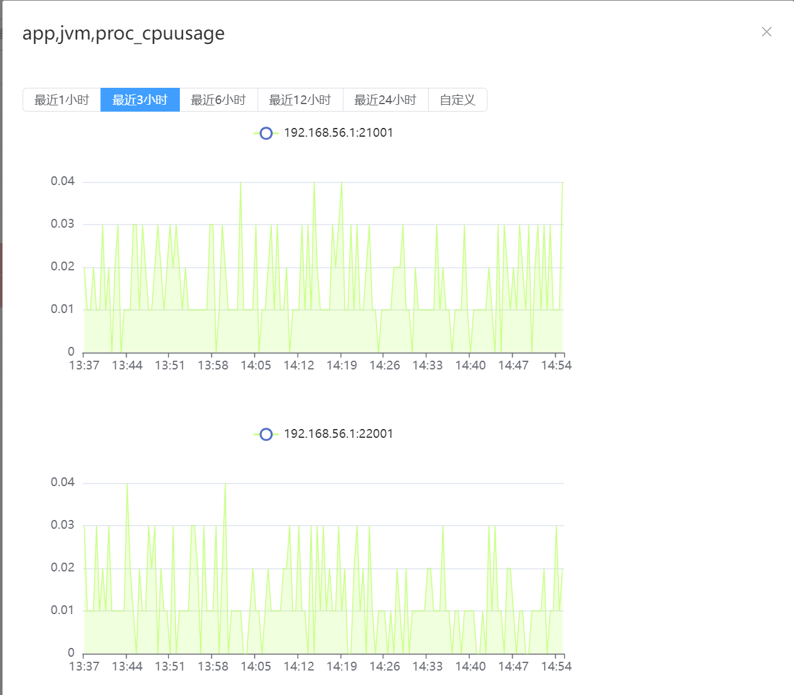


#### 实例指标趋势

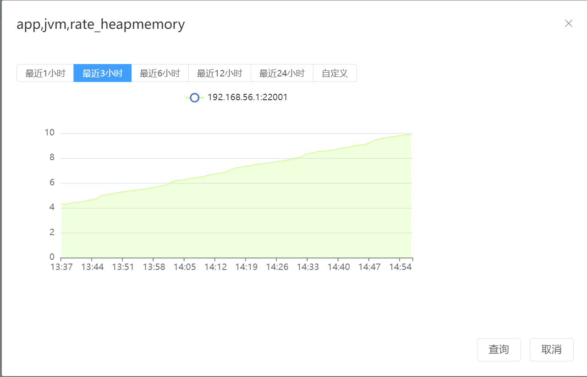

