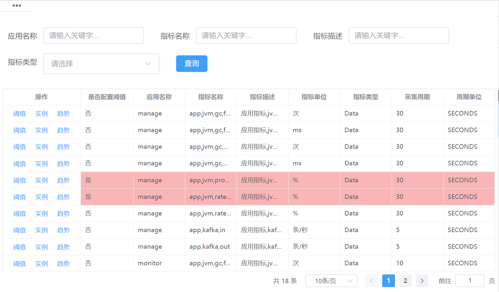
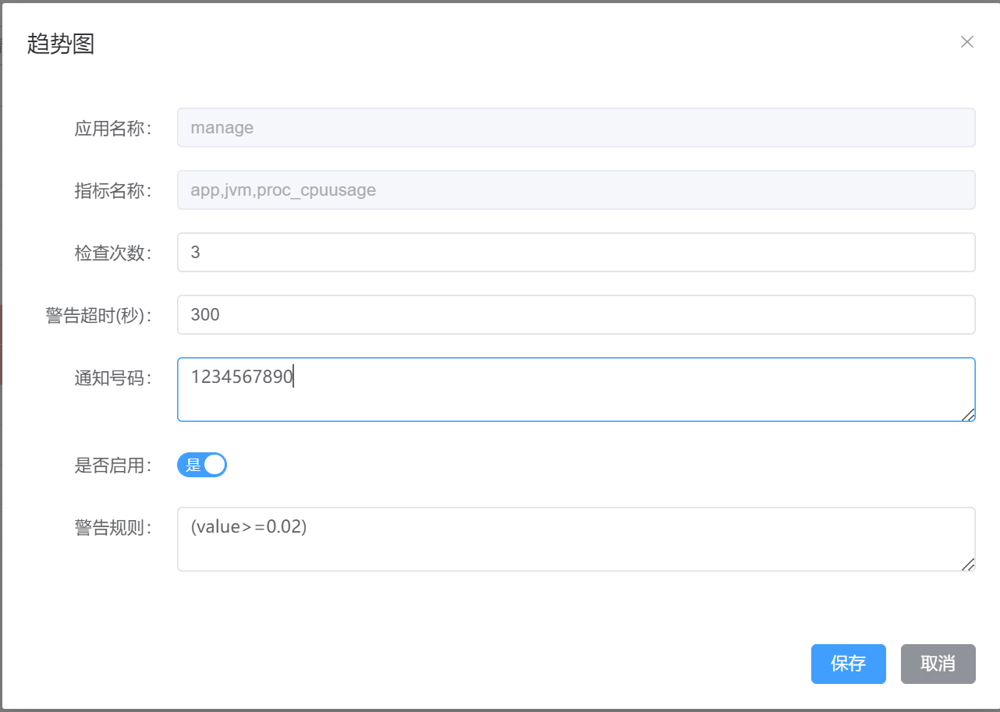
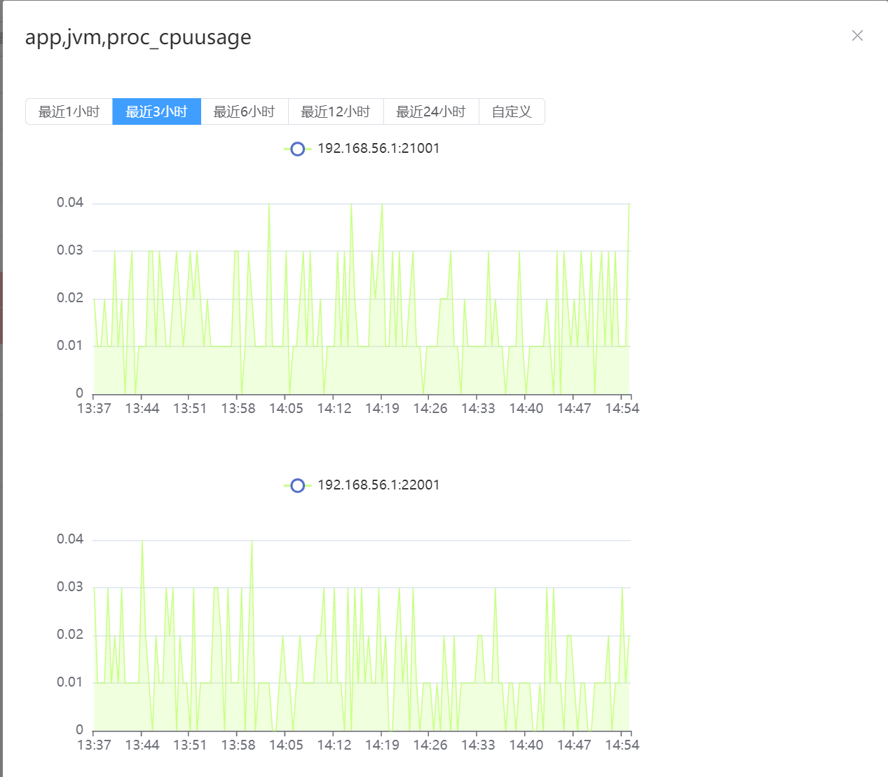
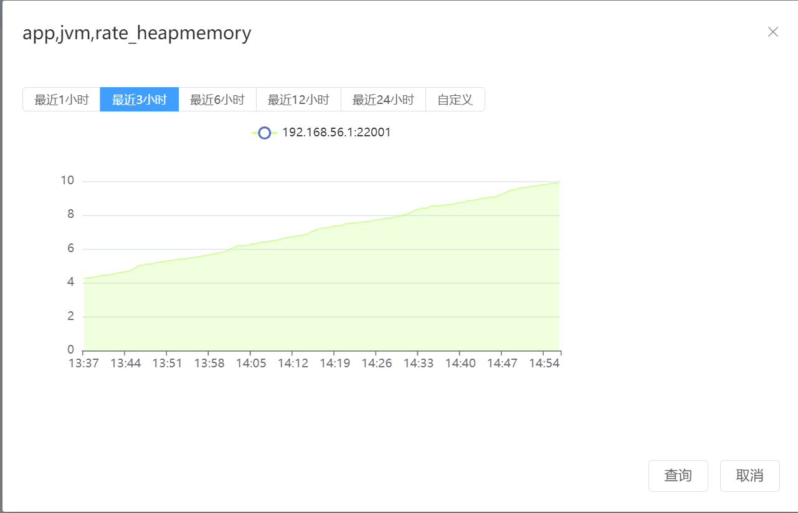

## 功能截图

### 指标列表



### 指标阈值配置




### 应用指标趋势




### 实例指标趋势




## 模块说明

收集各类（包括不限于应用、中间件、数据库、主机、网络等等）采集指标进行规则匹配，满足通知规则条件的指标进行警告通知。


## 通知接口扩展

实现以下接口，参考默认实现 `com.github.hbq.monitor.notify.sms.UniNotifyImpl`

```java
package com.github.hbq.monitor.notify;

/**
 * @author hbq
 */
public interface INotify {

  /**
   * 发送通知消息
   *
   * @param phoneNums
   * @param msg
   * @return
   */
  boolean send(String[] phoneNums, String msg);

  /**
   * 定义标识
   *
   * @return
   */
  String identify();
}
```


## 警告消息格式

```
警告时间: 2023-01-28 16:31:36
应用实例: manage,dc,192.168.56.2,21001
指标信息: app,jvm,rate_heapmemory,SECONDS:30,Data
指标数据: 10.94
通知规则: (value>10)
检查次数: 2
```


## 重要配置

```properties
# 指标数据存储数据库配置（可指定任意数据库,只需扩展mybatis sql映射文件编写对应的建表语句即可）
spring.datasource.quota.driver-class-name=org.h2.Driver
spring.datasource.quota.url=jdbc:h2:mem:quotadata
spring.datasource.quota.username=quota
spring.datasource.quota.password=quota
spring.datasource.quota.max-total=20
spring.datasource.quota.max-wait-millis=300000
spring.datasource.quota.validation-query=select 1

# 实例清理
hbq.agent.instance-alive-check.cron=0 */5 * * * *
hbq.agent.invalid-instance-clean.cron=0 0 * * * *
hbq.agent.invalid-instance-expire-time=1,DAYS

# 指标数据存储的数据库
hbq.monitor.dialect.store.max-batch-size=200
hbq.monitor.dialect.store.timeout-mills=5000
hbq.monitor.quota.data-reserve-days=7
hbq.monitor.quota.clean-cron=0 0 * * * *

# 警告通知配置
hbq.monitor.notify.uni.access-key-id=******
hbq.monitor.notify.uni.signature=******
hbq.monitor.notify.type=uni
```


